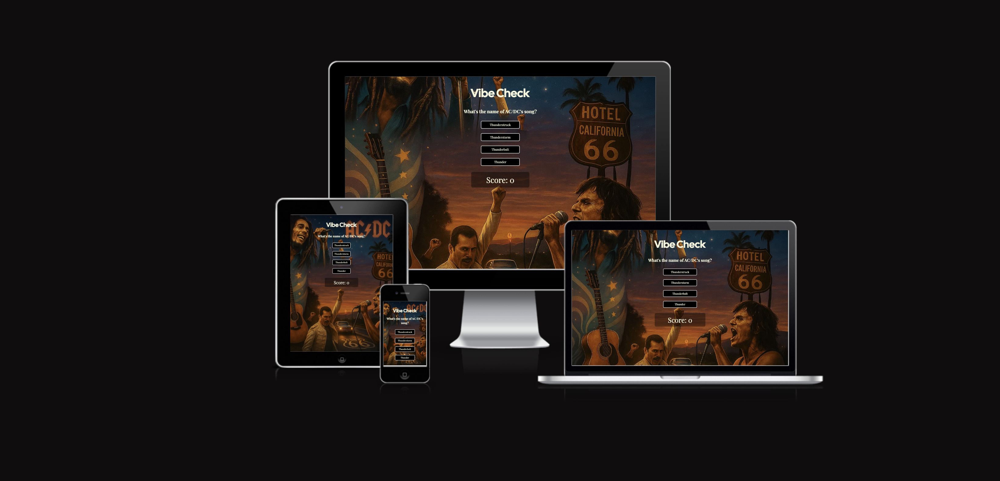
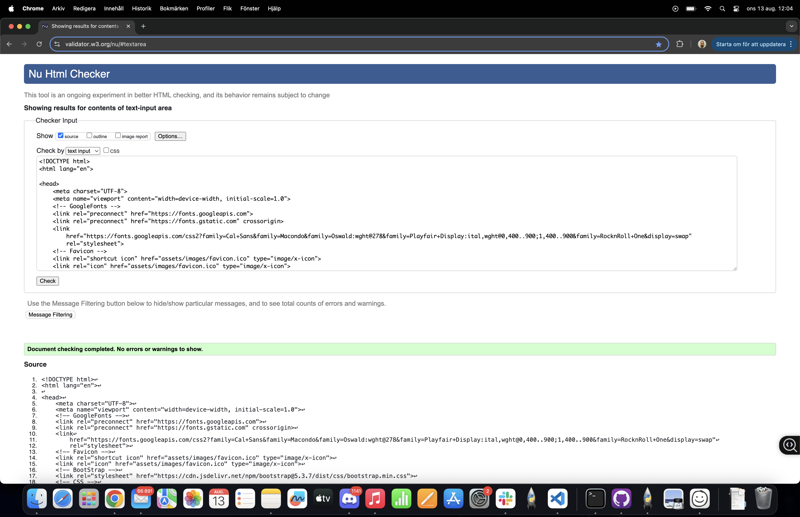
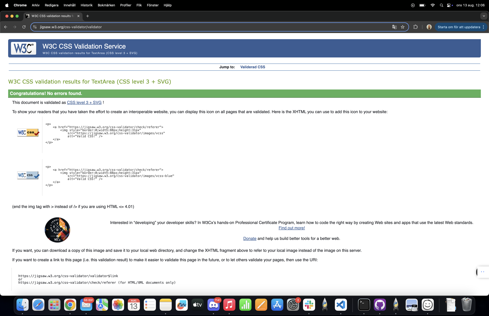
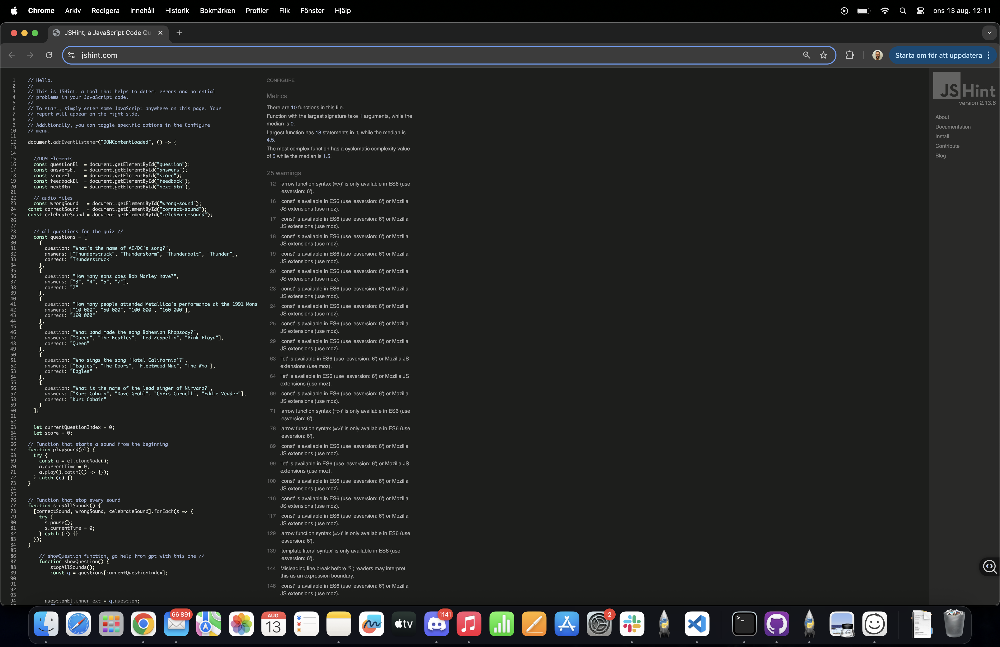
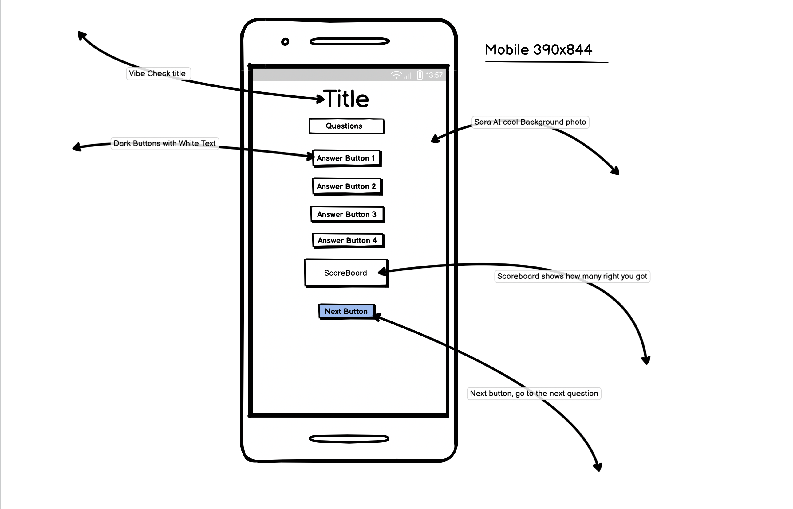

# Vibe-Check

**Vibe Check** Vibe Check is a simple, beginner-friendly music quiz that challenges users to test their knowledge of songs, artists, and trivia.

## Target Users
- People who like music and want to test their knowledge.
- Casual users who want a quick and fun game.
- Beginners who want a simple quiz to play.

## User Goals
- Play a quiz with clear feedback (colors, sounds, score).
- Use the quiz on mobile, tablet, or desktop.
- Restart the quiz easily anytime.

### Responsive Mockup
This image shows the site on different devices (made with “Am I Responsive”).

## Technologies Used
- HTML for structure
- CSS for styling 
- JavaScript for quiz logic and interactivity
- [Bootstrap 5](https://getbootstrap.com/)
- Favicon 
- [Canvas Confetti](https://www.npmjs.com/package/canvas-confetti)
- Audio files for right/wrong and celebration sounds
- [Google Fonts](https://fonts.google.com/)
- Used Sora AI (image generator) to make the background

## Design Choices
I chose bright, high-contrast colors for answer buttons so they are easy to see.
I used the photo generator “Sora” to give the quiz a friendly and old school feel.
I used Bootstrap to make the site responsive and work well on all screen sizes.
The layout is kept simple so users can focus on the quiz without distractions.

## Validation

- HTML validated with [W3C Markup Validator](https://validator.w3.org/) — no errors or warnings found.  
  

- CSS validated with [W3C CSS Validator](https://jigsaw.w3.org/css-validator/) — no errors or warnings found.  
  

- JavaScript checked with [JSHint](https://jshint.com/) — only ES6 syntax warnings (const, let, arrow functions). No functional errors.  
  

**Manual Tests**
- Click each answer, correct one makes yaya! sound.
- Next button loads next question.
- Play Again button resets quiz.
- Sounds play on correct/wrong.
- Celebratory confetti appears on 4 rights out of 6 or more score.
- Tested in Chrome, mobile view, and tablet.
- DevTools in Chrome to see any errors in the console. but no errors found.

## How It Works

- Questions and four answers are stored in a JavaScript array.

- On page load, the first question and its answers are displayed.

- The script checks if it matches the correct answer.

- Plays a correct or wrong sound. fart sound or yayya!

- Disables further clicks until proceeding.

- A "Next" button appears to load the next question.

- At the end, the final score and feedback message appear, with a "Play Again" button to restart.

- If the user scores more than half, confetti and a celebration sound play.

## Future Features

- audio sound and some music clips recognition
- API integration
- Add difficulty levels
- Show a timer for each question
- Add more visual feedback (colors, animations)

## Help Tools / Resources
**Used GitHub Copilot for code suggestions**

**Watched tutorial videos on YouTube to understand quiz logic**

**Referenced QuickRef.me for JavaScript syntax help**

**And when i have been hardstuck i got help from ChatGPT, explain on a deeper level**

## Installation

1. Clone the repository  
   `git clone https://github.com/mathiase4/Vibe-Check.git`  
2. Change into the project folder  
   `cd Vibe-Check`  
3. Open `index.html` in your browser.

## Usage

- Answer each question by clicking one of the four buttons.

- Listen for the “correct” or “wrong” sound.

- Click Next to proceed.

- At the end, view your score, feedback message, and click Play Again to restart.

## Wireframes

I made wireframes before I built the site. They show the layout only.

### Mobile (390×844)

### Desktop (1440×1040)

The hand‑drawn drafts are also in the repo for reference:
`assets/screenshots/wireframedesktop.jpg`.

---

## Final Design (Screenshots)

### Live Desktop View
This is a screenshot from the real site.

## Deployment

I published this site using GitHub Pages. Here's how I did it:

1. I pushed all my project files to GitHub in a public repository.
2. Then I clicked on the **Settings** tab in the repo.
3. I scrolled down to **Pages** in the sidebar.
4. Under **Source**, I selected the `main` branch and left the folder as `/ (root)`.
5. After a few seconds, GitHub gave me a link to the live site.

You can visit the live quiz here:  
👉 [https://mathiase4.github.io/Vibe-Check/](https://mathiase4.github.io/Vibe-Check/)

## Performance Testing

I tested the site using Chrome Lighthouse.

**Desktop Test**  
  
Scores: Performance 98, Accessibility 68, Best Practices 100, SEO 82

**Mobile Test**  
  
Scores: Performance 78, Accessibility 68, Best Practices 100, SEO 82

## Browser Testing
- Chrome – Works fine
- Firefox – Works fine
- Edge – Works fine
- Safari on iPhone – Works fine
  No issues found.

## Accessibility

I tested the site’s accessibility using Chrome Lighthouse.

The score was 68 for both desktop and mobile.  
Main suggestions were:
- Add alternative text for background images.
- Increase contrast for some text against the background.

I chose not to change the background image because it is part of the quiz theme.  
The buttons already have high contrast colors so they are easy to see.

### Manual Testing of Features

**Answer buttons**  
- **Expected:** Turn green if right, red if wrong. Only one button works for each question.  
- **Testing:** Clicked wrong answer, then right answer.  
- **Result:** Worked as expected.  
- **Fix:** No fix needed.  

**Scoreboard**  
- **Expected:** Increase by 1 if the answer is correct, no change if wrong.  
- **Testing:** Answered 4 questions (2 right, 2 wrong).  
- **Result:** Worked as expected.  
- **Fix:** No fix needed.  

**Next button**  
- **Expected:** Loads the next question and resets buttons.  
- **Testing:** Clicked **Next** after each question.  
- **Result:** Worked as expected.  
- **Fix:** No fix needed.  

**End of quiz**  
- **Expected:** Show score, feedback, and a “Play Again” button.  
- **Testing:** Played until the last question.  
- **Result:** Worked as expected.  
- **Fix:** No fix needed.  

**Play Again button**  
- **Expected:** Reset score and restart quiz.  
- **Testing:** Clicked “Play Again” after finishing.  
- **Result:** Worked as expected.  
- **Fix:** No fix needed.  

**Sounds**  
- **Expected:** Play correct/wrong sound every time. Celebration sound and confetti if score > half.  
- **Testing:** Answered quickly, clicked **Next** quickly.  
- **Result:** Worked after fix.  
- **Fix:** Stopped sounds before playing new ones.

**Keyboard focus**  
- **Expected:** Navigate between buttons using TAB and SHIFT+TAB.  
- **Testing:** Pressed TAB multiple times, then SHIFT+TAB.  
- **Result:** Worked as expected.  
- **Fix:** No fix needed.

**Responsive design**  
- **Expected:** Works on mobile, tablet, and desktop.  
- **Testing:** Used Chrome DevTools to switch between device sizes (390×844, tablet, desktop).  
- **Result:** Layout adapted correctly on all sizes.  
- **Fix:** No fix needed.

---

### Code Validation

- **HTML:** Checked with [W3C Validator](https://validator.w3.org/) – no errors found.  
- **CSS:** Checked with [W3C CSS Validator](https://jigsaw.w3.org/css-validator/) – no errors found.  
- **JavaScript:** Checked with [JSHint](https://jshint.com/) – only ES6 syntax warnings; no functional issues.

---

### Bugs Found and Fixed

- **Sound playback overlap on fast clicks**  
  - **Issue:** Sounds overlapped or skipped if clicking quickly.  
  - **Fix:** Added function to stop all audio before playing new sound.

---

### Open Problems

No open problems found – the site works as intended across devices and browsers.

## What i have done today
- 2025-06-18, i have created the Quiz through html simple structure and made the questions inside the js file.
- 2025-06-19, been developing the Quiz in js for the most part, fixed the buttons/answers and scoreboard, fixed Favicon so it looks more nice aswell.
- 2025-06-21, got stuck on code in JS,Trying to fix the audio/right/wrong sounds. dont know how to fix it but im trying my best.
- 2025-06-22, fixed the problem on playagainbutton, didnt have DOMcontenctLoaded on the script so got error in devtools.
- 2025-06-23, goes pretty well actually. the quiz feels kinda finished already. fixed the buttons from max-width 400 to 200px so it looks nice on all screens!, checked the code with validator for html and css, no errors or warnings were found!. did lighthouse check in incognito mode, in devtools and everything looks good! 95+% in performance in everything!
  
  

## Author

Mathias Eriksson – [GitHub/mathiase4](https://github.com/mathiase4)

## License

This project is licensed under the MIT License. 
