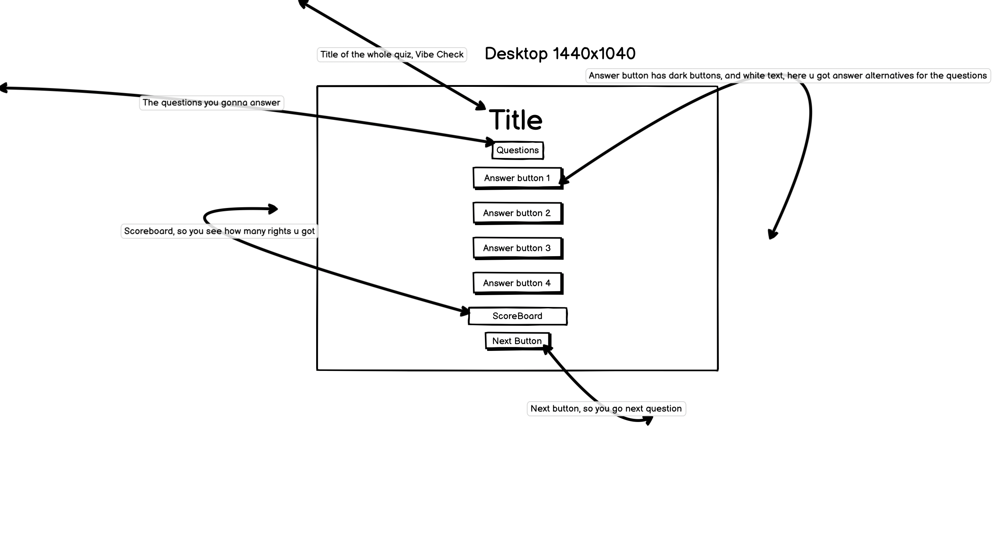

# Vibe-Check

**Vibe Check** Vibe Check is a simple, beginner-friendly music quiz that challenges users to test their knowledge of songs, artists, and trivia.

## Technologies Used
- HTML for structure
- CSS for styling 
- JavaScript for quiz logic and interactivity
- [Bootstrap 5](https://getbootstrap.com/)
- Favicon 
- [Canvas Confetti](https://www.npmjs.com/package/canvas-confetti)
- Audio files for right/wrong and celebration sounds
- [Google Fonts](https://fonts.google.com/)
- Used Sora AI to make the background

## Validation

- HTML validated with [W3C Markup Validator](https://validator.w3.org/) — no errors or warnings found.  
  

- CSS validated with [W3C CSS Validator](https://jigsaw.w3.org/css-validator/) — no errors or warnings found.  
  

- JavaScript checked with [JSHint](https://jshint.com/) — only ES6 syntax warnings (const, let, arrow functions). No functional errors.  
  

**Manual Tests**
- Click each answer, correct one makes yaya! sound.
- Next button loads next question.
- Play Again button resets quiz.
- Sounds play on correct/wrong.
- Celebratory confetti appears on 4 rights out of 6 or more score.
- Tested in Chrome, mobile view, and tablet.
- DevTools in Chrome to see any errors in the console. but no errors found.

## How It Works

- Questions and four answers are stored in a JavaScript array.

- On page load, the first question and its answers are displayed.

- The script checks if it matches the correct answer.

- Plays a correct or wrong sound. fart sound or yayya!

- Disables further clicks until proceeding.

- A "Next" button appears to load the next question.

- At the end, the final score and feedback message appear, with a "Play Again" button to restart.

- If the user scores more than half, confetti and a celebration sound play.

## Future Features

- audio sound and some music clips recognition
- API integration
- Add difficulty levels
- Show a timer for each question
- Add more visual feedback (colors, animations)

## Help Tools / Resources
**Used GitHub Copilot for code suggestions**

**Watched tutorial videos on YouTube to understand quiz logic**

**Referenced QuickRef.me for JavaScript syntax help**

**And when i have been hardstuck i got help from ChatHPT, explain on a deeper level**

## Installation

1. Clone the repository  
   `git clone https://github.com/mathiase4/Vibe-Check.git`  
2. Change into the project folder  
   `cd Vibe-Check`  
3. Open `index.html` in your browser.

## Usage

- Answer each question by clicking one of the four buttons.

- Listen for the “correct” or “wrong” sound.

- Click Next to proceed.

- At the end, view your score, feedback message, and click Play Again to restart.

## Wireframes

I made wireframes before I built the site. They show the layout only.

### Mobile (390×844)

### Desktop (1440×1040)

The hand‑drawn drafts are also in the repo for reference:
`assets/screenshots/wireframedesktop.jpg`.

---

## Final Design (Screenshots)

### Responsive Mockup
This image shows the site on different devices (made with “Am I Responsive”).

### Live Desktop View
This is a screenshot from the real site.

## Deployment

I published this site using GitHub Pages. Here's how I did it:

1. I pushed all my project files to GitHub in a public repository.
2. Then I clicked on the **Settings** tab in the repo.
3. I scrolled down to **Pages** in the sidebar.
4. Under **Source**, I selected the `main` branch and left the folder as `/ (root)`.
5. After a few seconds, GitHub gave me a link to the live site.

You can visit the live quiz here:  
👉 [https://mathiase4.github.io/Vibe-Check/](https://mathiase4.github.io/Vibe-Check/)

## Performance Testing

Used Chrome Lighthouse to test performance and accessibility.
All scores were above 95+% for mobile and desktop.

Desktop scores:
- Performance: 97
- Accessibility: 96
- Best Practices: 100
- SEO: 100

Mobile scores:
- Performance: 96 (incognito mode)
- Accessibility: 100
- Best Practices: 100

## Testing

I tested the quiz by myself.  
I clicked things and checked if they worked.  
I also looked on different screen sizes and checked my code with online tools.

---

### 1) Manual tests

**Answer buttons**  
- Expected: Turn green if right, red if wrong. Only one button works for each question.  
- Testing: I clicked a wrong answer, then a right answer.  
- Result: Worked as expected.  
- Fix: No fix needed.  

**Scoreboard**  
- Expected: Go up by 1 if the answer is right, no change if wrong.  
- Testing: I answered 4 questions 2 right, 2 wrong.  
- Result: Worked as expected.  
- Fix: No fix needed.  

**Next button**  
- Expected: Goes to the next question and resets the buttons.  
- Testing: I clicked **Next** after each answer.  
- Result: Worked as expected.  
- Fix: No fix needed.  

**End of quiz**  
- Expected: Show my score, feedback text, and a "Play again" button.  
- Testing: I played until the last question.  
- Result: Worked as expected.  
- Fix: No fix needed.  

**Play again button**  
- Expected: Reset the score and start the quiz again from question 1.  
- Testing: I clicked "Play again" after finishing the quiz.  
- Result: Worked as expected.  
- Fix: No fix needed.  

**Sounds**  
- Expected: Play correct/wrong sound every time. Play celebration sound and show confetti if score is more than half.  
- Testing: I answered quickly and pressed **Next** quickly to see if sound works.  
- Result: Worked after fix.  
- Fix: I stop the sound before playing again.

**Keyboard focus**
- Expected: I can move between buttons with TAB and SHIFT+TAB.
- Testing: Pressed TAB many times, then SHIFT+TAB to go back.
- Result: Worked as expected.
- Fix: No fix needed.

**Responsive check**
- Expected: The quiz should work on mobile, tablet, and desktop.
- Testing: Opened DevTools in Chrome and switched between device sizes (mobile, tablet, desktop).
- Result: Everything looked fine, no layout break.
- Fix: No fix needed.

- Screenshots:
- 
- 
- 

**Code check**
- HTML: Checked with W3C Validator, no errors found.
- CSS: Checked with W3C CSS Validator, no errors found.
- JavaScript: Checked with JSHint, no big problems found.
- Fix: No fix needed.

**Bugs I found and fixed**
- Bug: Sounds would sometimes play over each other.
- Fix: I made a small function to stop all sounds before playing a new one.

**Summary**
The quiz works well. All main features work like planned, it is responsive, and there are no errors in the code validators.

## What i have done today
- 2025-06-18, i have created the Quiz through html simple structure and made the questions inside the js file.
- 2025-06-19, been developing the Quiz in js for the most part, fixed the buttons/answers and scoreboard, fixed Favicon so it looks more nice aswell.
- 2025-06-21, got stuck on code in JS,Trying to fix the audio/right/wrong sounds. dont know how to fix it but im trying my best.
- 2025-06-22, fixed the problem on playagainbutton, didnt have DOMcontenctLoaded on the script so got error in devtools.
- 2025-06-23, goes pretty well actually. the quiz feels kinda finished already. fixed the buttons from max-width 400 to 200px so it looks nice on all screens!, checked the code with validator for html and css, no errors or warnings were found!. did lighthouse check in incognito mode, in devtools and everything looks good! 95+% in performance in everything!
  
  

## Author

Mathias Eriksson – [GitHub/mathiase4](https://github.com/mathiase4)

## License

This project is licensed under the MIT License. 
